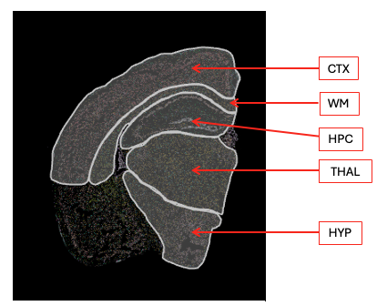

```{r}
# BiocManager::install("speckle")
# https://bioconductor.org/packages/devel/bioc/vignettes/speckle/inst/doc/speckle.html
library(qs2)
library(Seurat)
library(tidyverse) 
library(speckle)
library(kableExtra)

immune <- UpdateSeuratObject(qs_read("seurat_objects/20260225-mg_kai.qs2"))
Idents(immune) <- "sub.cluster"
# Order samples by Treatment.Group so groups are adjacent
immune$sample_ID <- factor(
  immune$sample_ID,
  levels = c("KK4_465", "KK4_504", "KK4_496", "KK4_492", "KK4_502", "KK4_464"))
```

| Sample ID | Treatment Group |
|-----------|-----------------|
| KK4_465   | IgG             |
| KK4_504   | IgG             |
| KK4_496   | IgG             |
| KK4_492   | Adu             |
| KK4_502   | Adu             |
| KK4_464   | Adu             |

```{r}


p <- plotCellTypeProps(immune,
                  clusters = Idents(immune),
                  sample = immune$sample_ID)

# Enforce sample_ID factor order on x-axis
sample_order <- c("KK4_465", "KK4_504", "KK4_496", "KK4_492", "KK4_502", "KK4_464")
p + scale_x_discrete(limits = sample_order) +
  theme_minimal() +
  theme(axis.title = element_text(size = 14),
        axis.text.x = element_text(size = 13, angle = 30, hjust = 1),
        axis.text.y = element_text(size = 13),
        legend.text = element_text(size = 14))

```


The function propeller from the speckl package tests whether **cell-type proportions differ between experimental conditions**, while properly accounting for **biological replication and sample-to-sample variability**.

* aggregates single cells into **sample-level cell-type proportions**,
* applies a variance-stabilizing transformation (e.g. logit or arcsin),
* fits a **linear model** for each cell type,
* uses **empirical Bayes moderation** to stabilize variance estimates across cell types, and
* controls for **multiple testing**.

As a result, propeller identifies **true compositional changes** in cell populations and avoids false positives driven by uneven cell capture or outlier samples.

**Transform**
In propeller, *transform* refers to converting raw cell-type proportions into a scale where statistical testing is valid. Proportions are bounded between 0 and 1 and have unequal variance, so transforming them stabilizes variance and allows linear models to be used appropriately.

**Logit**
The *logit* transform maps proportions from [0,1] to $(-\infty, +\infty)$ using

$\log\left(\frac{p}{1-p}\right)$

This reduces heteroskedasticity, improves power to detect differences in cell-type abundance, and makes effects interpretable as differences in log-odds, while small offsets are used to handle zeros.
***
   
**Robust**
In propeller, *robust* refers to using robust empirical Bayes variance estimation in the linear model. This down-weights the influence of outlier samples with extreme cell-type proportions, preventing them from artificially inflating significance.

In practice, `robust = TRUE` makes the test more resistant to technical or biological outliers while preserving group means, leading to more reliable inference on cell-type composition differences.

## Test for differences in immune cell type proportions between treatment groups in total brain
```{r}
# The propeller function can take a SingleCellExperiment object or Seurat object as input 
# and extract the three necessary  pieces of information from the cell information stored in colData.
#  The three essential pieces of information are

# cluster (Idents function by default)
# sample
# group

prop <- propeller(
  x = immune,
  clusters = Idents(immune),
  sample = immune$sample_ID,
  group = immune$Treatment.Group,
  trend = FALSE,
  robust = TRUE,
  transform = "logit")

prop |> as_tibble () |> 
  kbl(digits = 3) |> 
  kable_styling("striped")
```

### Interpretation

| Column                  | Brief explanation                                                                                                  |
| ----------------------- | ------------------------------------------------------------------------------------------------------------------ |
| `BaselineProp.clusters` | Cell type or cluster being tested for proportional differences between conditions.                                 |
| `BaselineProp.Freq`     | Overall mean proportion of the cluster across all samples, independent of condition.                               |
| `PropMean.Adu`          | Mean sample-level proportion of the cluster in the Adu group.                                                      |
| `PropMean.IgG`          | Mean sample-level proportion of the cluster in the IgG group.                                                      |
| `PropRatio`             | Ratio of mean proportions between groups (Adu / IgG); values >1 indicate enrichment in Adu, <1 depletion.          |
| `Tstatistic`            | Moderated t-statistic testing whether transformed proportions differ between conditions; sign indicates direction. |
| `P.Value`               | Raw p-value for the difference in proportions for that cluster.                                                    |
| `FDR`                   | False discovery rate–adjusted p-value accounting for testing across all clusters.                                  |

## Immune cell type proportions by brain region



```{r}
md <- immune@meta.data |> 
  group_by(Idents(immune),Region) |> 
  summarise(n.cells = n()) |> 
  pivot_wider(names_from = Region, values_from = n.cells)

kbl(md, caption = "number of cells per cluster per region") |> 
  kable_styling("striped")
```

```{r propeller-by-region}

# Wrap propeller so that regions where the model fails return NULL instead of an error
safe_propeller <- possibly(propeller, otherwise = NULL)

# Get all annotated regions, dropping NA entries
regions <- unique(immune$Region) |> na.omit() |> as.character()

# Run propeller separately for each brain region
prop_by_region <- map(regions, \(reg) {
  # Subset to cells from this region only
  sub <- subset(immune, Region == reg)

  # Skip if either treatment group has < 2 samples (propeller requires replication)
  n_per_group <- table(
    distinct(sub@meta.data, sample_ID, Treatment.Group)$Treatment.Group
  )
  if (any(n_per_group < 2)) return(NULL)

  # Test for proportion differences between Adu and IgG within this region
  safe_propeller(
    x         = sub,
    clusters  = Idents(sub),
    sample    = sub$sample_ID,
    group     = sub$Treatment.Group,
    trend     = FALSE,
    robust    = TRUE,       # down-weights outlier samples
    transform = "logit"     # variance-stabilising transform for bounded proportions
  )
}) |>
  # Name list elements by region, then drop NULLs (skipped/failed regions)
  set_names(regions) |>
  compact()

# Combine per-region results into a single data frame with a Region column
prop_region_df <- imap(prop_by_region, \(tbl, reg) {
  as_tibble(tbl) |> mutate(Region = reg)
}) |>
  list_rbind()
```

```{r heatmap-region-props}
#| fig.width: 12
#| fig.height: 8

prop_heatmap <- prop_region_df |>
  mutate(
    # Convert PropRatio (Adu/IgG) to log2 scale; set Inf/NaN (zero in one group) to NA
    log2ratio = case_when(
      is.nan(log2(PropRatio)) | is.infinite(log2(PropRatio)) ~ NA_real_,
      TRUE ~ log2(PropRatio)
    ),
    # Overlay significance stars on coloured tiles, and × on grey (zero-proportion) tiles
    stars = case_when(
      is.na(log2ratio)   ~ "\u00d7",   # cross for 0-proportion tiles
      P.Value < 0.001    ~ "***",
      P.Value < 0.01     ~ "**",
      P.Value < 0.05     ~ "*",
      TRUE               ~ ""
    )
  )

# Order cell types by mean log2ratio across regions (Adu-enriched at top)
celltype_order <- prop_heatmap |>
  group_by(BaselineProp.clusters) |>
  summarise(mean_r = mean(log2ratio, na.rm = TRUE)) |>
  arrange(desc(mean_r)) |>
  pull(BaselineProp.clusters)

prop_heatmap <- prop_heatmap |>
  mutate(
    CellType  = factor(BaselineProp.clusters, levels = rev(celltype_order)),
    Region    = factor(Region),
    # Use a darker grey for × marks so they remain visible on the grey background
    cross_col = ifelse(is.na(log2ratio), "grey30", "grey15")
  )

# Symmetric colour scale limit (rounded up to nearest integer)
clim <- ceiling(max(abs(prop_heatmap$log2ratio), na.rm = TRUE))

ggplot(prop_heatmap, aes(x = Region, y = CellType, fill = log2ratio)) +
  # Tile fill encodes direction and magnitude of the proportion shift
  geom_tile(colour = "white", linewidth = 0.5) +
  coord_equal() +
  # Significance stars (or ×) overlaid on each tile
  geom_text(aes(label = stars, colour = cross_col), size = 10, vjust = 0.75) +
  # Pass colour strings directly without mapping to a scale
  scale_colour_identity() +
  # Diverging palette: red = Adu-enriched, blue = IgG-enriched, grey = undefined
  scale_fill_distiller(
    palette   = "RdBu",
    direction = -1,
    limits    = c(-clim, clim),
    na.value  = "grey88",
    name      = "log2(Adu/IgG)"
  ) +
  labs(
    title    = "Cell type proportions by brain region",
    subtitle = "Fill: log2(PropRatio Adu/IgG);  * p<0.05  ** p<0.01",
    x = NULL, y = NULL
  ) +
  theme_minimal(base_size = 13) +
  theme(
    axis.text.x     = element_text(angle = 40, hjust = 1, size = 18),
    axis.text.y     = element_text(size = 18),
    panel.grid      = element_blank(),
    legend.position = "right",
    plot.title      = element_text(face = "bold", size = 18),
    plot.subtitle   = element_text(size = 16, colour = "grey40")
  )
```


```{r tables-by-region}
#| results: asis

iwalk(prop_by_region, \(tbl, reg) {
  cat("\n\n<details><summary>**", reg, "**</summary>\n\n")
  tbl |>
    as_tibble() |>
    arrange(FDR) |>
    kbl(digits = 3, caption = paste("Region:", reg)) |>
    kable_styling("striped", full_width = FALSE) |>
    print()
  cat("\n\n</details>\n\n")
})
```
