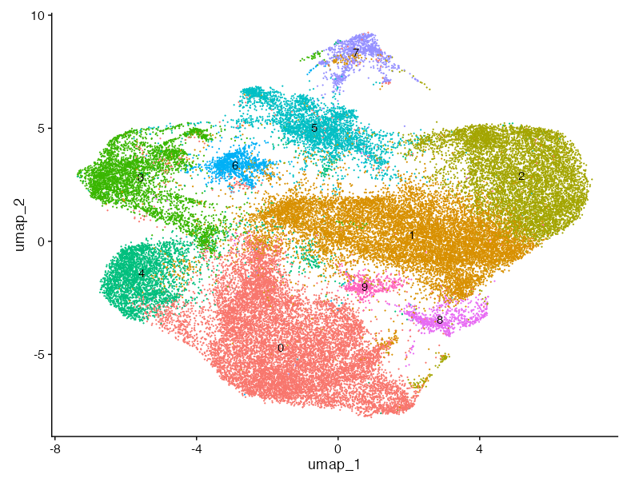

```{r}
#| label: setup
#| message: false
library(qs2)
library(Seurat)
library(patchwork)
library(tidyverse)
library(kableExtra)
library(DESeq2)
library(gridExtra)
library(jsonlite)

```


## Excluded genes
 
 ```{r}
 
# genes to remove #########################################################
# Load gene list and extract CELL SPECIFIC markers (excluding ASTROCYTE)
gene_list     <- read_json("results/Xenium_Final_Gene_List_Updated_20260220_corrected.json")
cell_specific <- gene_list[["CELL SPECIFIC"]]
cell_specific[["ASTROCYTE"]] <- NULL

# One row per gene with cell_type label
markers <- map_dfr(names(cell_specific), function(ct) {
  tibble(cell_type = ct, gene = unlist(cell_specific[[ct]]))
}) |> 
  pull(gene)


### genes manually selected by Akhil ###
akhil <- c(
  "Tmem119", "Aif1", "Trem2", "P2ry12", "Ermn", "Cldn11", "Mog",
  "Ccdc153", "Dnah11", "Tmem212", "Pdgfra", "Tnr", "Mgp", "Bgn",
  "Slc47a1", "Acta2", "Tagln", "Vtn", "Kcnj8", "Atp13a5", "Flt1",
  "Emcn", "Cldn5", "Car12", "Ttr", "Col1a2", "Lum", "Dcx", "Pax6",
  "Mgl2", "Mrc1", "Cd3d", "Gzmb", "Pdcd1", "Klrb1c", "Tpsab1",
  "Tpsb2", "Fcer1a", "Plac8", "Msr1", "Ly6g", "Camp", "Cd209a",
  "Clec10a", "Cd247", "Snap25", "Grin2a", "Grin2b", "Cux2", "Otof",
  "Stard8", "Lypd1", "Lrg1", "Adamts2", "Macc1", "Rapgef3", "Rorb",
  "Tcap", "Hsd11b1", "Rspo1", "Whrn", "Tunar", "Osr1", "Oprk1",
  "Pou3f1", "Tshz2", "Tox2", "Syt6", "Trh", "Vip", "Calb2", "Pthlh",
  "Crh", "Gad1", "Serpinf1", "Cnr1", "Lhx6", "Slc32a1", "Slc17a7",
  "Fezf2", "Htr2c", "Dpp4", "Slc17a6", "Siglech", "Clec7a", "Lyz2",
  "Cd14", "Cst7", "Pf4", "Nkg7", "Cx3cr1", "Itgax", "Cd68", "Mbp",
  "Mag", "Pllp", "Lamp5", "Nts", "Tac1", "Sncg", "Sst", "Calb1",
  "Ndnf")

 # setdiff(akhil, markers)
 ```

**Removed cell markers** `r paste(markers, collapse = ", ")` and **Akhil´s hand-picked genes** `r paste(setdiff(akhil, markers), collapse = ", ")`


```{r}
#| eval: false
#| label: clean-seurat

# Load seurat with subsetted astrocytes object 
astro_subset <- qs2::qs_read("seurat_objects/20260305-astro_0.3.qs2")
astro_keep <- WhichCells( # astrocyte markers
  astro_subset, expression = (Aldh1l1 > 0 | Aldoc > 0 | Slc7a10 > 0 | Gfap > 0 | Aqp4 > 0))
astro.obj <- subset(obj, cells = astro.keep)
genes_to_remove <- akhil
all_features <- Features(astro_subset)
keep_genes <- all_features[!all_features %in% genes_to_remove]
############################################################################


astro_cleaned  <- subset(astro_subset, subset = seurat_clusters!=6)
astro_cleaned  <- subset(astro_cleaned, features = keep_genes)
# Keep only the assay needed for fresh SCTransform
DefaultAssay(astro_cleaned) <- "Xenium"
astro0 <- DietSeurat(astro_cleaned, assays = "Xenium", dimreducs = NULL, graphs = NULL)
# Drop Xenium image/FOV segmentation data; otherwise merge triggers huge future globals
astro0@images <- list()

```

```{r}
#| eval: false
# SCTransform on all astrocytes together (no split/merge, no integration)

astro <- SCTransform(
  astro0,
  assay = "Xenium",
  new.assay.name = "SCT",
  verbose = FALSE
)
```

```{r}
#| eval: false
#| label: LogNormalize
## Log-normalised alternative

# Log-normalise, find variable features, and scale
astro_log <- NormalizeData(astro0, normalization.method = "LogNormalize", scale.factor = 10000)
astro_log <- FindVariableFeatures(astro_log, selection.method = "vst", nfeatures = 2000)
astro_log <- ScaleData(astro_log, features = VariableFeatures(astro_log))

# PCA, neighbours, clustering, UMAP
set.seed(1234)
astro_log <- RunPCA(astro_log, features = VariableFeatures(astro_log), verbose = FALSE)
astro_log <- FindNeighbors(astro_log, reduction = "pca", dims = 1:15)
astro_log <- FindClusters(astro_log, resolution = 0.3)
astro_log <- RunUMAP(astro_log, reduction = "pca", dims = 1:15, verbose = FALSE)

DimPlot(astro_log, label =T, label.size = 6, pt.size =0.9)+ NoLegend() +
  ggtitle("Removed cluster 6 and 103 marker genes\nLog-normalized") 

# qs2::qs_save(astro_log, "seurat_objects/20260318-astro_lognorm_0.3.qs2")
```


## PCA and dimensionality selection

```{r}
#| eval: false
#| label: Run PCA & Neighbors on SCT assay
DefaultAssay(astro) <- "SCT"
astro <- RunPCA(
  astro,
  assay   = "SCT",
  features = VariableFeatures(astro),
  verbose = FALSE)


# find nearest neighbours

# Set seed for reproducibility
set.seed(1234)

# Compute nearest neighbors using first 30 PCs
astro <- FindNeighbors(astro, reduction = "pca", dims = 1:30, graph.name = "astro_snn")

# Perform clustering at multiple resolutions for later comparison
astro <- FindClusters(astro, graph.name = "astro_snn", resolution = 0.3)

# Compute UMAP for visualization
astro <- RunUMAP(astro, reduction = "pca", dims = 1:30, verbose = FALSE)

## save cleaned object
# qs_save(astro, "seurat_objects/20260318-astro_cleaned2_0.3.qs2")
```


```{r}
## load cleaned object
astro <- qs2::qs_read("seurat_objects/20260318-astro_cleaned2_0.3.qs2")

# swap to log-normalised version when ready:
# astro <- qs2::qs_read("seurat_objects/20260318-astro_lognorm_0.3.qs2")
```

```{r}
#| fig-width: 5
#| fig-height: 3
#| label: Elbow plot
# Elbow plot to visualise variance explained per PC
ElbowPlot(astro, ndims = 50) +
  geom_vline(xintercept = 30, linetype = "dashed", color = "red") +
  labs(title = "Elbow plot") +
  theme_minimal()
```

```{r}
#| fig-height: 5
#| label: PCA biplots

# PCA biplots coloured by sample and treatment
p1 <- DimPlot(astro, reduction = "pca", group.by = "Slide") +
  labs(title = "PCA — Slide")
p2 <- DimPlot(astro, reduction = "pca", group.by = "Treatment.Group") +
  labs(title = "PCA — Treatment")
p1 + p2
```


resolution = 0.3

::: {layout-ncol=3 .column-page}
{width=100% height=600px}

{width=100% height=400px}

:::

```{r}
#|fig-width: 5
#|fig-height: 5
#| label: plot UMAPs 1
DimPlot(astro, label =T, label.size = 6, pt.size =0.9)+ NoLegend() +
  ggtitle("Removed cluster 6 and 103 marker genes") 
```

```{r}
#| fig-width: 10
#| column: page
#| fig-height: 5
#| label: plot UMAPs 2
DimPlot(astro, split.by = "Treatment.Group", label.size = 6, pt.size =0.9)+ NoLegend()
```

## Top marker genes per cluster

`FindAllMArkers` run on log-normalized residual expression values from SCTransform in the SCT assay (Values are continuous and typically centered around 0)
```{r}
#| eval: false
#| label: find markers
Idents(astro) <- astro$seurat_clusters
DefaultAssay(astro) <- "SCT"
all_markers <- FindAllMarkers(astro, only.pos = TRUE, densify = TRUE)

# write_csv (only marker genes removed)
# write_csv(all_markers, file = "results/20260309-astrocyte_cleaned_all_markers_0.3.csv")
#################################################################
# write_csv (cluster 6 from the original object &  marker genes removed)
# write_csv(all_markers, file = "results/20260312-astrocyte_cleaned_all_markers_0.3.csv")
#################################################################
# write_csv (cluster 6 from the original object &  marker genes + Akhil genes removed)
# write_csv(all_markers, file = "results/20260318-astrocyte_cleaned_all_markers_0.3.csv")
write_csv(all_markers, file = "results/20260318-astrocyte_cleaned_all_markers_0.3_logtrans.csv")
```

```{r}
#| label: top markers per cluster
#| column: screen
#| fig-width: 15
#| fig-height: 4
source("20260217-helper_functions.R")

# Top 5 markers per cluster by avg_log2FC
top_genes <- read_csv("results/20260318-astrocyte_cleaned_all_markers_0.3.csv",
                      show_col_types = FALSE) |>
  group_by(cluster) |>
  arrange(desc(avg_log2FC), .by_group = TRUE) |>
  slice_head(n = 5) |>
  pull(gene) |>
  unique()

fiddle(astro,
       genes_of_interest = top_genes,
       classification_col = "seurat_clusters",
       assay = "SCT")
```

### Cluster identity assessment

Based on the top 5 marker genes per cluster, we assessed whether each cluster represents true astrocytes or contaminating cell types from the initial subsetting.


## Astrocyte markers


```{r}
#| label: astrocyte-markers-featureplot
#| column: page
#| fig-height: 12
#| fig-width: 10

FeaturePlot(astro,features = c("Aldh1l1",	"Aldoc",	"Gfap",	"Slc7a10",	"Aqp4"), ncol=2, min.cutoff = "q20")
```

```{r}
#| label: astrocyte-markers-violin
#| column: page
#| fig-height: 12
#| fig-width: 10

VlnPlot(astro,features = c("Aldh1l1",	"Aldoc",	"Gfap",	"Slc7a10",	"Aqp4"),alpha = 0, ncol=2)
```

